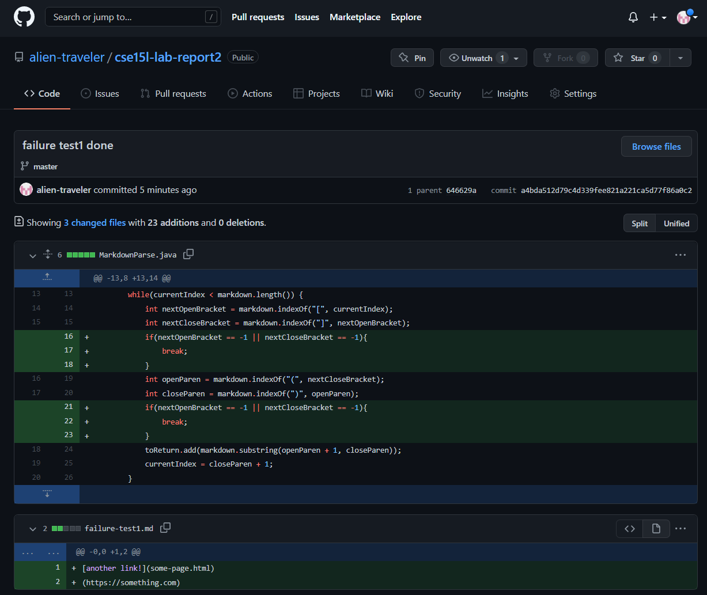
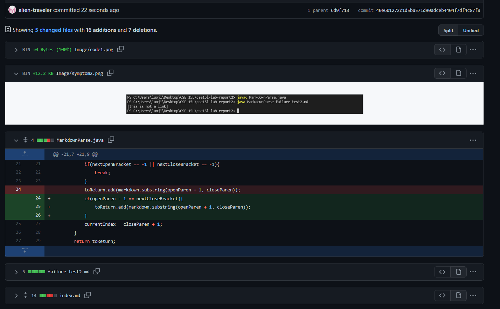
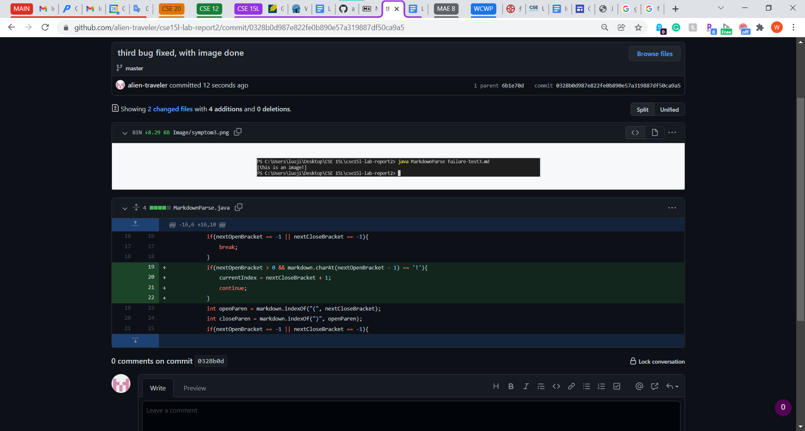

# Lab Report 2
Pick three code changes that your group worked on in labs 3 and 4 in order to fix a bug; these should be stored as commits on someone’s repository. Fork the repository so you have your own copy with all the work your group did if you haven’t already.

For each of the three code changes:

Show a screenshot of the code change diff from Github (a page like this)
Link to the test file for a failure-inducing input that prompted you to make that change
Show the symptom of that failure-inducing input by showing the output of running the file at the command line for the version where it was failing (this should also be in the commit message history)
Write 2-3 sentences describing the relationship between the bug, the symptom, and the failure-inducing input.

---

**Problem 1: Having parenthesis with no brackets before it will make it loop infinitely**

*WHY?* The `indexOf` function returns -1 if it doesn't find its target, causing the search to loop through the file infinitely. 

*Solution:* We can fix it by adding if statements to check and make sure the program does not continue if any searches result in -1. We add the if statements after searching for brackets and after searching for parenthesis, checking if either fail.

*Symptom:* In the command line, the output is infinitly waiting.

*Failure-inducing input:* When there no brackets after a pair of parenthesis, the program will run into an infinite loop.

*Failure-inducing file:* [link is here](failure-test1.md)

---

**Problem 2: Having no parentheses leads to an IndexOutOfBoundsException**

*WHY?* The program will interpret any set of parenthesis following any set of brackets as a link when it should not. 

*Solution:* We can fix it by adding if statements to check if the element before the openbracket is the next closed bracket. Only append the string in the parenthesis to the result list if this statement returns true.

*Symptom:* In the command line, the output might be something that is not the link.

*Failure-inducing input:* when a bracket and a parenthesis are not right next to each other 

*Failure-inducing file:* [link is here](failure-test2.md)

---

**Problem 3: Using an image will have the program mistake the image for a link**

*WHY?* Image notation has an exclamation mark in front of the brackets, but everything else is the same as the link notation. If you do not check teh exclamation mark, you will add image links to the result list.

*Solution:* We can fix it by first checking the open bracket is not the first character in the text, and then we can check if the character before the next open bracket is an exclamation mark. If yes, add the link to the result list. 

*Symptom:* In the command line, the output might be an image link, which is not the link.

*Failure-inducing input:* when an image link is in the file while there is not a link notation.

*Failure-inducing file:* [link is here](failure-test3.md)

